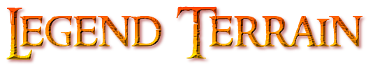

# LegendTerrain



---

## Introduction

`LegendTerrain` is an in-progress framework that is being designed for procedural environment and terrain generation. This framework will set the foundation for dynamic, expansive, and immersive game worlds.

---

## Planned Features

- **Procedural Generation**: Create vast and diverse terrains on-the-fly.
- **Real-time Manipulation**: Manipulate verticies of the terrain in real-time.
- **Optimized for Performance**: Lazy-loading and modern algorithms to allow for expansive worlds.
- **Customizable Parameters**: Tailor the generation to fit the desired theme or biome through layers of noise as well as allow customizable shaders.
- **Serializable Chunks**: Chunks can be saved or loaded on the fly allowing for worlds to expand up to the integer limit.

---

## Installation

1. Clone the repository:
    ```bash
    git clone https://github.com/YOUR_GITHUB_USERNAME/LegendTerrain.git
    ```
2. Open the project in visual studio:
    ```bash
    LegendTerrain\LegendTerrain\LegendTerrain.sln
    ```
3. Add the includes and libraries to the project:
	```bash
	VC++ Directories
		Include Directories: Path/To/Your/GLAD,GLFW,GLM
		Library Directories: Path/To/Your/GLAD,GLFW,GLM
	```
4. Run in x64 configuration

---
